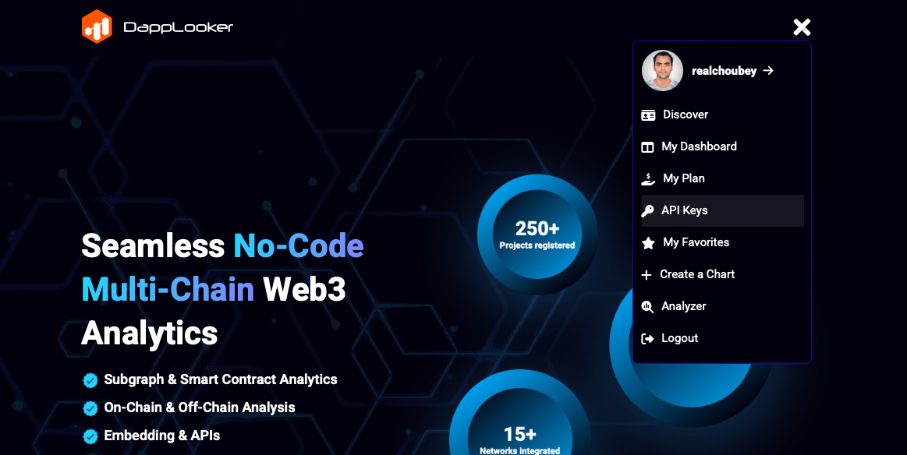
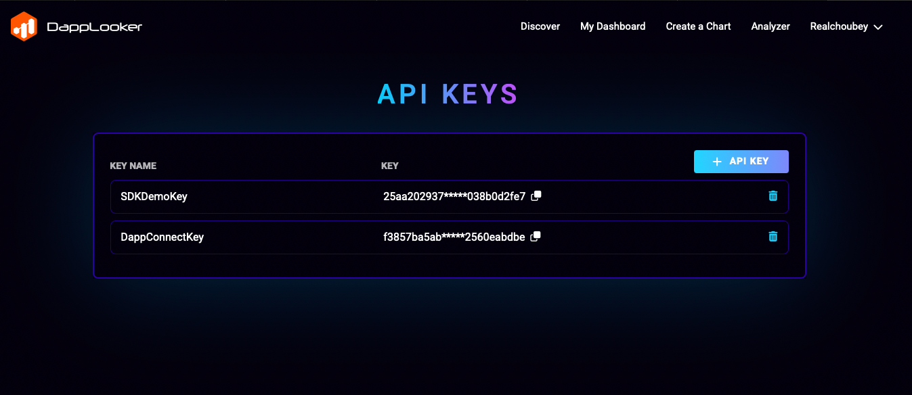
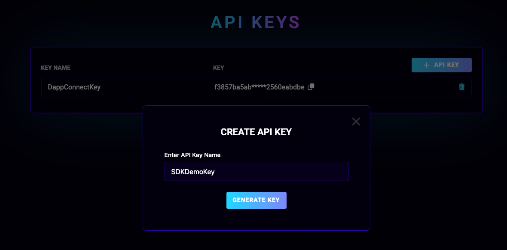
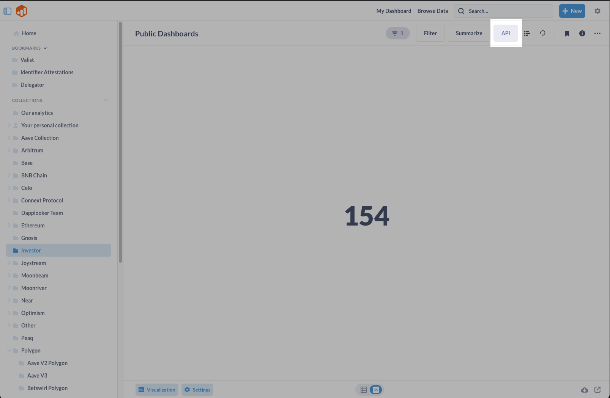

<h1 align="center">
    <picture>
        <source media="(prefers-color-scheme: light)" srcset="https://d2yxqfr8upg55w.cloudfront.net/assets/img/DL_logo_1800%20X%20400.png">
        <source media="(prefers-color-scheme: dark)" srcset="https://d2yxqfr8upg55w.cloudfront.net/assets/img/DL_LOGO_dark_theme.png">
        
    </picture>
</h1>

<p align="center">
  <i align="center" style="font-size:0.9em;" >Get free blockchain analytics for Smart Contract, Subgraph, Defi, NFT, and Gaming dApps. Analyze and query on-chain and off-chain web3 data from Ethereum, Polygon, TheGraph, Celo, Polkadot, NEAR with our no-code dashboard..🚀</i>
</p>

<h4 align="center">

  <a href="https://discord.com/invite/dapplooker">
    
  </a>
  </a>
</h4>

<h1>Introduction</h1>

<h3> What is DappLooker?</h3>
<p style="font-size:1em;">
DappLooker is a no-code multi-chain community-driven analytics and visualization platform for blockchain networks and Dapps. Users can run Visual SQL queries on blockchain data, using easy to use simple editor. Charts and dashboards can be forked, edited, and shared with the community.

DappLooker aims to empower everyone to easily understand blockchain data, do analytics and easily build beautiful charts and dashboards. You can build and share key metrics for Defi, NFT, gaming, and multi-chain protocols.
</p>
<br>


<p style="font-weight:600;">Welcome to the GitHub profile for DappLooker</p>

📚 Read our comprehensive [documentation](https://dapplooker.notion.site/dapplooker/DappLooker-Documentation-f3113336bdce4ecea688fa0ba69cec98) to learn how to start building with DappLooker.


# DappLooker SDK

Programmatic access to the most reliable &amp; comprehensive blockchain data in Web3.

Integrate your DappLooker SDK and get popular charts data

## Installation

#### 1. Install the SDK:

```bash
npm install @dapplooker/dapplooker-sdk
```

#### 2. Generate API key:

- Create an account on the [DappLooker website](https://dapplooker.com/).
- After Signup, Go to the [API keys](https://dapplooker.com/user/api) page.

- Click "+ API key".

- Give your API key a name and Click "Generate".

- Now Copy your API Key.

#### 3. Get Your Chart UUID

- Go to [DappLooker Analytics Website](https://analytics.dapplooker.com/)
- Create a new Chart or Open a Existing Created Chart

- Click "API" Button
- Get the UUID of your chart from the chart API Endpoint


#### 4. Import the SDK

Once you have imported the SDK, you can create a DapplookerSDK instance and make API calls using the API key and chart UUID that you obtained in the previous steps.

### Examples

```javascript
const DappLookerSDK = require("dapplooker-sdk");

const getChartData = async () => {
  let id = "dc9b69d8-7ca1-45d4-8ad0-a17f915f3f0"; // Replace it with chart UUID you are working with
  let key = "qzusb5p3q246ip246ab6g0p8ppzb7u"; // Replace it with your API key

  let response = await DappLookerSDK.chartAPIData(id, key);
  console.log("Chart data: ", JSON.stringify(response?.data));
};

getChartData();
```

Typescript support is also available

```jsx
//Typescript
import { DappLookerSDK } from "dapplooker-sdk";
```

<h1>Social Links</h1>

Follow us to stay updated with the latest news and updates!

<a href="https://dapplooker.com/" target="_blank">Website</a>
<a href="https://dapplooker.com/community" target="_blank">Discord</a>
<a href="https://twitter.com/dapplooker" target="_blank">Twitter</a>
<a href="https://t.me/dapplooker" target="_blank">Telegram</a>
<a href="https://dapplooker.medium.com/" target="_blank">Medium</a>
<a href="https://www.linkedin.com/company/dapplooker/" target="_blank">Linkedin</a>
<a href="https://www.youtube.com/channel/UC1KJmtb3UhnWSN_sDv71_fg" target="_blank">Youtube</a>

